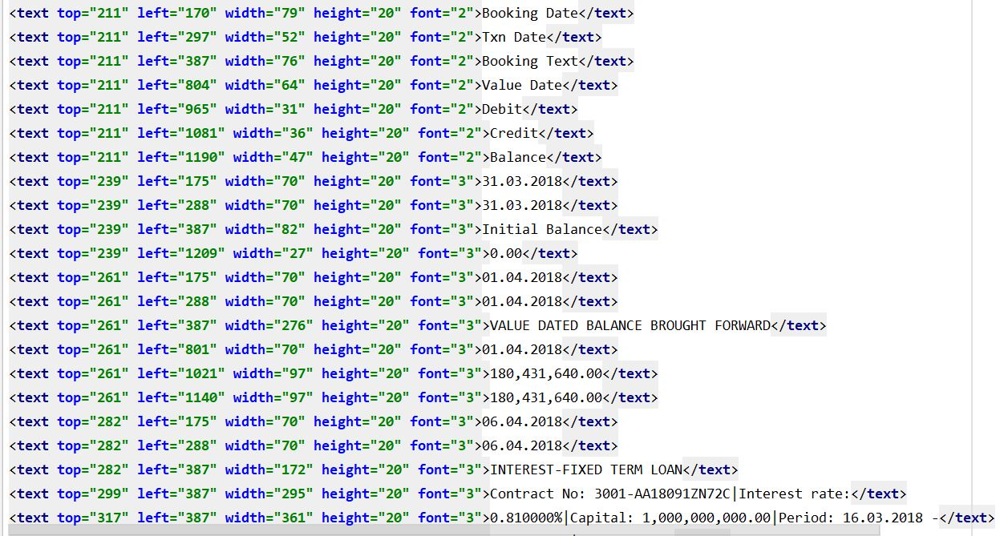

# Canopy PDF table Extraction

PDF table extraction can be done in many ways. Some examples:

    - A custom config file indicating where each table is (string-based matching, column distinction, etc.)
    - Using OpenCV for table detection or row separation 
    - A third-party library such as Camelot-Py or Tabula-Py-Hardcoded strings
    - Use Poppler utilities to extract and use string matching and processing.
    
This module is using last defined method in the above list. 
Poppler utilitiy ___'pdftohtml'___ to generate the xml from the PDF file.

Sample xml output:

This module works with the following logic and ___specific to this kind of problem.___
Notice carefully from the xml output that each cell in the table has certain properties. For this problem,
font size 2 and 3 are specific to table data. This is the Key to filter table data from xml.

In order to recreate the table from xml output, one must need reference to cell properties to fill in the right table columns.
For this problem, after a thorough look, __'LEFT'__ attribute is good enough to determine which table cell the data is from. For start, 
first the module determines the table headings _(font size: 2)_ and _'LEFT'_ attribute values. In further iterations of processing xml file,
module searches whether _'LEFT'_ falls with in certain range. _(range because based on the content size the cell props vary)_

Based on the above working logic, PDF table is recreated and filled into Pandas Dataframes and the same dataframe is written to excel sheet with minor modifications according to problem statement.
